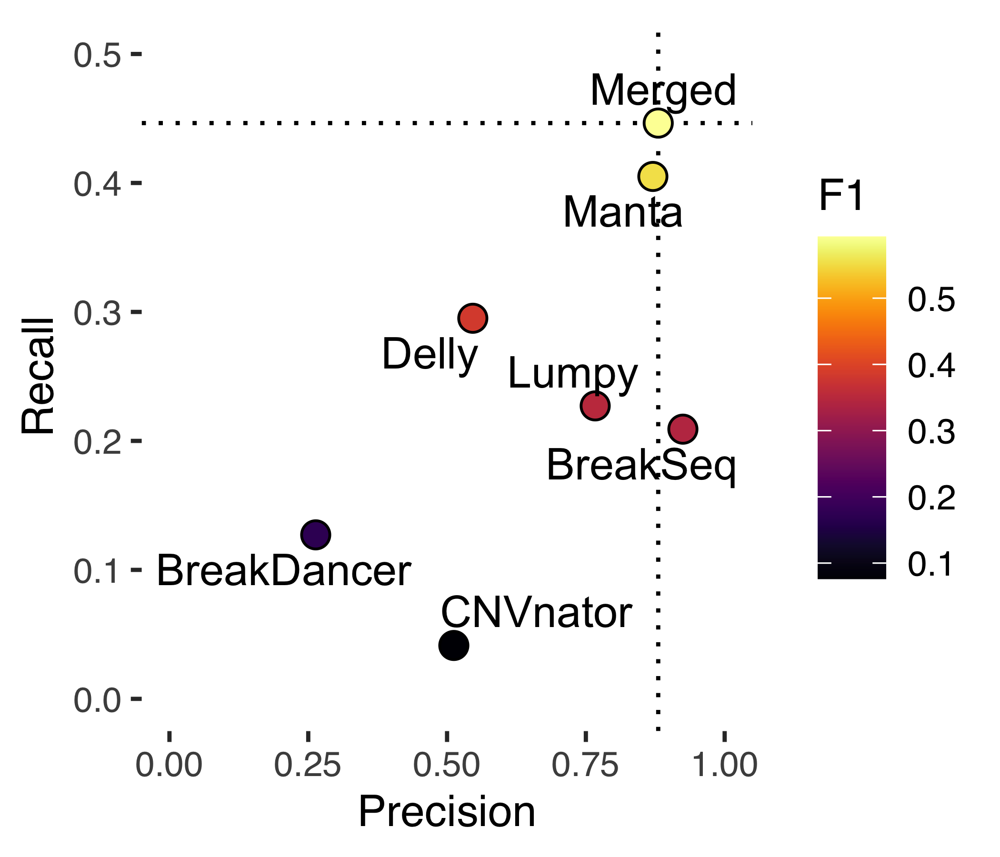

SV pipeline - Benchmark
================

## Genome in a Bottle framework

In order to measure the performance of individual SV detection tools and
merging strategies, we applied the SVs benchmarking dataset from GiaB.
This dataset contains SVs for the AshkenazimTrio son: HG002 (NA24385)
using several sequencing strategies and Sv detection tools, as well a
manual curation. Here we are using the v0.6 of the Tier 1 (isolated,
sequence-resolved SVs). There is also the Tier 2 (regions with at least
one likely SV but it is complex or we were unable to determine a
consensus sequence change), not used here.

For measuring the precision and recall for each method, we used the tool
truvari. An example command is:

    truvari.py -b HG002_SVs_Tier1_v0.6.vcf.gz -c your.vcf.gz -o yourvcfvsGIABv0.6 --passonly --includebed HG002_SVs_Tier1_v0.6.bed -r 2000 --giabreport

## Tier 1 overview

## HG002 - SV calls summary by tool (raw)

| Tool        | Total | DEL   | DUP   | INS  | INV  | BND   |
|:------------|------:|:------|:------|:-----|:-----|:------|
| GIAB        | 12745 | 5464  | 0     | 7281 | 0    | 0     |
| Manta       | 11697 | 6135  | 647   | 2743 | 340  | 1832  |
| Lumpy       | 12540 | 5405  | 588   | 0    | 31   | 6516  |
| Delly       | 52511 | 19697 | 9308  | 4175 | 7414 | 11917 |
| BreakDancer | 19945 | 3758  | 13120 | 1498 | 641  | 0     |
| BreakSeq    |  2883 | 2686  | 0     | 197  | 0    | 0     |
| CNVnator    |  4335 | 3303  | 1032  | 0    | 0    | 0     |

## Benchmark overview

\#\# HG002 - SV calls summary by tool (filtered)

1.  Keeping only calls from chr 1-22+X+Y
2.  Removing SVs smaller than 50 bp
3.  PASS only (for some tools)

| Tool        | Total | DEL  | DUP  | INS  | INV  | BND  |
|:------------|------:|:-----|:-----|:-----|:-----|:-----|
| GIAB        | 12745 | 5464 | 0    | 7281 | 0    | 0    |
| Manta       |  9105 | 5131 | 521  | 2089 | 288  | 1076 |
| Lumpy       | 11163 | 4049 | 588  | 0    | 30   | 6496 |
| Delly       | 13252 | 7497 | 1810 | 118  | 1004 | 2823 |
| BreakDancer |  9421 | 3685 | 2710 | 1496 | 632  | 0    |
| BreakSeq    |  2883 | 2686 | 0    | 197  | 0    | 0    |
| CNVnator    |  4140 | 3198 | 942  | 0    | 0    | 0    |

## Benchmarking for HG002 (after filtering)

## DEL only

## INS only

## DUPtoINS only

## Performance per tool - DEL (Scatter plot)

Here we investigate different merging strategies starting with simple
comparisons between tools and than using different combinations of
tools, merging calls by UNION, INTERSECTION, or with at least ‘N’ tools
support.

Results are evaluated in terms of precision, recall and F1 score, as
showed in the plot below.

## Merging DEL - Strategy 1

STRATEGY 1 - combines UNION of different tools

Tools are merged using SURVIVOR and calls with at least 1 caller support
are kept (i.e. the UNION of calls)

Top 10 F1 score - Strategy 1

|     | tool |    recall | precision |        f1 | desc                                       |
|:----|:-----|----------:|----------:|----------:|:-------------------------------------------|
| 11  | 11   | 0.7325554 | 0.9041740 | 0.8093672 | Manta;SVE\|BreakSeq                        |
| 42  | 42   | 0.7570850 | 0.8683420 | 0.8089059 | Manta;SVE\|BreakSeq;LUMPY                  |
| 38  | 38   | 0.7394618 | 0.8831058 | 0.8049255 | Manta;SVE\|LUMPY;SVE\|BreakSeq             |
| 13  | 13   | 0.7330317 | 0.8911407 | 0.8043904 | Manta;LUMPY                                |
| 81  | 81   | 0.7592284 | 0.8503601 | 0.8022144 | Manta;SVE\|LUMPY;SVE\|BreakSeq;LUMPY       |
| 40  | 40   | 0.7363658 | 0.8719684 | 0.7984506 | Manta;SVE\|LUMPY;LUMPY                     |
| 31  | 31   | 0.7539890 | 0.8353562 | 0.7925898 | Manta;SVE\|BreakDancer;SVE\|BreakSeq       |
| 72  | 72   | 0.7639914 | 0.8123576 | 0.7874325 | Manta;SVE\|BreakDancer;SVE\|BreakSeq;LUMPY |
| 41  | 41   | 0.7418433 | 0.8378160 | 0.7869142 | Manta;SVE\|BreakSeq;Delly                  |
| 35  | 35   | 0.7508931 | 0.8253927 | 0.7863823 | Manta;SVE\|CNVnator;SVE\|BreakSeq          |

## Merging DEL - Strategy 2

STRATEGY 2 - combines INTERSECTION of different tools

Tools are merged using SURVIVOR and calls supported by all callers are
kept (i.e. the INTERSECTION of calls)

Top 10 F1 score - Strategy 2

|     | tool |    recall | precision |        f1 | desc                                            |
|:----|:-----|----------:|----------:|----------:|:------------------------------------------------|
| 1   | 1    | 0.6575375 | 0.9318259 | 0.7710137 | intersect\_Manta                                |
| 7   | 7    | 0.5172660 | 0.8887070 | 0.6539214 | intersect\_LUMPY                                |
| 13  | 13   | 0.4496309 | 0.9667179 | 0.6137841 | intersect\_Manta;LUMPY                          |
| 5   | 5    | 0.4520124 | 0.9276637 | 0.6078463 | intersect\_SVE\|BreakSeq                        |
| 27  | 27   | 0.4029531 | 0.9808696 | 0.5712357 | intersect\_SVE\|BreakSeq;LUMPY                  |
| 11  | 11   | 0.3765182 | 0.9838208 | 0.5446090 | intersect\_Manta;SVE\|BreakSeq                  |
| 42  | 42   | 0.3512741 | 0.9879437 | 0.5182713 | intersect\_Manta;SVE\|BreakSeq;LUMPY            |
| 18  | 18   | 0.3105501 | 0.9595291 | 0.4692335 | intersect\_SVE\|BreakDancer;LUMPY               |
| 16  | 16   | 0.2931650 | 0.9762094 | 0.4509158 | intersect\_SVE\|BreakDancer;SVE\|BreakSeq       |
| 52  | 52   | 0.2774470 | 0.9898046 | 0.4334077 | intersect\_SVE\|BreakDancer;SVE\|BreakSeq;LUMPY |

## Merging DEL - Strategy 3

STRATEGY 3 - combines different tools and uses calls found by at least X
tools

Tools are merged using SURVIVOR and calls supported by X callers are
kept

Top F1 score - Strategy 3

|     | tool |        f1 | precision |    recall |
|:----|-----:|----------:|----------:|----------:|
| 2   |    2 | 0.7424046 | 0.9388201 | 0.6139557 |
| 1   |    1 | 0.7333636 | 0.7008900 | 0.7689926 |
| 3   |    3 | 0.6160351 | 0.9712821 | 0.4510598 |
| 4   |    4 | 0.4418175 | 0.9843621 | 0.2848297 |
| 5   |    5 | 0.1566820 | 0.9972067 | 0.0850202 |
| 6   |    6 | 0.0281756 | 1.0000000 | 0.0142891 |
| 7   |    7 | 0.0009522 | 1.0000000 | 0.0004763 |

## Merging DEL - Strategy 4

All possible combination of tool (by INTERSECTION) are compared with
different thresholds for the number of supporting tools (<INFO:SUPP>).

Calls are removed if below the threshold.

Top 10 F1 score - Strategy 4

|     | tool |    recall | precision |        f1 | desc                                      |
|:----|:-----|----------:|----------:|----------:|:------------------------------------------|
| 1   | 1    | 0.6575375 | 0.9318259 | 0.7710137 | Manta\|(1)                                |
| 7   | 7    | 0.5172660 | 0.8887070 | 0.6539214 | LUMPY\|(1)                                |
| 18  | 18   | 0.4496309 | 0.9667179 | 0.6137841 | Manta;LUMPY\|(1)                          |
| 5   | 5    | 0.4520124 | 0.9276637 | 0.6078463 | SVE\|BreakSeq\|(1)                        |
| 46  | 46   | 0.4029531 | 0.9808696 | 0.5712357 | SVE\|BreakSeq;LUMPY\|(1)                  |
| 14  | 14   | 0.3765182 | 0.9838208 | 0.5446090 | Manta;SVE\|BreakSeq\|(1)                  |
| 89  | 89   | 0.3512741 | 0.9879437 | 0.5182713 | Manta;SVE\|BreakSeq;LUMPY\|(1)            |
| 28  | 28   | 0.3105501 | 0.9595291 | 0.4692335 | SVE\|BreakDancer;LUMPY\|(1)               |
| 24  | 24   | 0.2931650 | 0.9762094 | 0.4509158 | SVE\|BreakDancer;SVE\|BreakSeq\|(1)       |
| 119 | 119  | 0.2774470 | 0.9898046 | 0.4334077 | SVE\|BreakDancer;SVE\|BreakSeq;LUMPY\|(1) |

## Merging DEL - Strategy 5

All possible combination of tool (by UNION) are compared with different
thresholds for the number of supporting tools (<INFO:SUPP>).

Calls are removed if below the threshold.

Top 10 F1 score - Strategy 5

|     | tool |    recall | precision |        f1 | desc                                                                            |
|:----|:-----|----------:|----------:|----------:|:--------------------------------------------------------------------------------|
| 2   | 2    | 0.7461300 | 0.9190378 | 0.8236067 | Manta + SVE\|BreakDancer;SVE\|CNVnator;SVE\|LUMPY;SVE\|BreakSeq;Delly;LUMPY (2) |
| 60  | 60   | 0.7494642 | 0.9009447 | 0.8182527 | Manta;SVE\|BreakSeq + SVE\|BreakDancer;SVE\|CNVnator;SVE\|LUMPY;Delly;LUMPY (3) |
| 59  | 59   | 0.7547035 | 0.8924247 | 0.8178065 | Manta;SVE\|BreakSeq + SVE\|BreakDancer;SVE\|CNVnator;SVE\|LUMPY;Delly;LUMPY (2) |
| 54  | 54   | 0.7470826 | 0.9001435 | 0.8165018 | Manta;SVE\|LUMPY + SVE\|BreakDancer;SVE\|CNVnator;SVE\|BreakSeq;Delly;LUMPY (2) |
| 61  | 61   | 0.7406525 | 0.9038070 | 0.8141361 | Manta;SVE\|BreakSeq + SVE\|BreakDancer;SVE\|CNVnator;SVE\|LUMPY;Delly;LUMPY (4) |
| 69  | 69   | 0.7511312 | 0.8879505 | 0.8138305 | Manta;LUMPY + SVE\|BreakDancer;SVE\|CNVnator;SVE\|LUMPY;SVE\|BreakSeq;Delly (2) |
| 3   | 3    | 0.7194570 | 0.9306839 | 0.8115514 | Manta + SVE\|BreakDancer;SVE\|CNVnator;SVE\|LUMPY;SVE\|BreakSeq;Delly;LUMPY (3) |
| 185 | 185  | 0.7554180 | 0.8745520 | 0.8106312 | Manta;SVE\|LUMPY;SVE\|BreakSeq + SVE\|BreakDancer;SVE\|CNVnator;Delly;LUMPY (2) |
| 186 | 186  | 0.7506549 | 0.8806929 | 0.8104911 | Manta;SVE\|LUMPY;SVE\|BreakSeq + SVE\|BreakDancer;SVE\|CNVnator;Delly;LUMPY (3) |
| 62  | 62   | 0.7339843 | 0.9043427 | 0.8103063 | Manta;SVE\|BreakSeq + SVE\|BreakDancer;SVE\|CNVnator;SVE\|LUMPY;Delly;LUMPY (5) |

## Performance per tool - INS (Scatter plot)

Here we investigate different merging strategies starting with simple
comparisons between tools and than using different combinations of
tools, merging calls by UNION, INTERSECTION, or with at least ‘N’ tools
support.

Results are evaluated in terms of precision, recall and F1 score, as
showed in the plot below.

## Merging INS - Strategy 1

STRATEGY 1 - combines UNION of different tools

Tools are merged using SURVIVOR and calls with at least 1 caller support
are kept (i.e. the UNION of calls)

Top 10 F1 score - Strategy 1

|     | tool |    recall | precision |        f1 | desc                                               |
|:----|:-----|----------:|----------:|----------:|:---------------------------------------------------|
| 11  | 11   | 0.2160970 | 0.9460981 | 0.3518325 | Manta;SVE\|BreakSeq                                |
| 35  | 35   | 0.2160970 | 0.9460981 | 0.3518325 | Manta;SVE\|CNVnator;SVE\|BreakSeq                  |
| 38  | 38   | 0.2160970 | 0.9460981 | 0.3518325 | Manta;SVE\|LUMPY;SVE\|BreakSeq                     |
| 42  | 42   | 0.2160970 | 0.9460981 | 0.3518325 | Manta;SVE\|BreakSeq;LUMPY                          |
| 74  | 74   | 0.2160970 | 0.9460981 | 0.3518325 | Manta;SVE\|CNVnator;SVE\|LUMPY;SVE\|BreakSeq       |
| 78  | 78   | 0.2160970 | 0.9460981 | 0.3518325 | Manta;SVE\|CNVnator;SVE\|BreakSeq;LUMPY            |
| 81  | 81   | 0.2160970 | 0.9460981 | 0.3518325 | Manta;SVE\|LUMPY;SVE\|BreakSeq;LUMPY               |
| 110 | 110  | 0.2160970 | 0.9460981 | 0.3518325 | Manta;SVE\|CNVnator;SVE\|LUMPY;SVE\|BreakSeq;LUMPY |
| 41  | 41   | 0.2175671 | 0.9128759 | 0.3513874 | Manta;SVE\|BreakSeq;Delly                          |
| 77  | 77   | 0.2175671 | 0.9128759 | 0.3513874 | Manta;SVE\|CNVnator;SVE\|BreakSeq;Delly            |

## Merging INS - Strategy 2

STRATEGY 2 - combines INTERSECTION of different tools

Tools are merged using SURVIVOR and calls supported by all callers are
kept (i.e. the INTERSECTION of calls)

Top 10 F1 score - Strategy 2

|     | tool |    recall | precision |        f1 | desc                     |
|:----|:-----|----------:|----------:|----------:|:-------------------------|
| 1   | 1    | 0.1944138 | 0.9505840 | 0.3228070 | \*Manta                  |
| 5   | 5    | 0.0216832 | 0.9076923 | 0.0423546 | \*SVE\|BreakSeq          |
| 6   | 6    | 0.0099228 | 1.0000000 | 0.0196507 | \*Delly                  |
| 2   | 2    | 0.0007350 | 0.0028756 | 0.0011708 | \*SVE\|BreakDancer       |
| 8   | 8    | 0.0003675 | 1.0000000 | 0.0007348 | \*Manta;SVE\|BreakDancer |
| 3   | 3    | 0.0000000 | 0.0000000 | 0.0000000 | \*SVE\|CNVnator          |
| 4   | 4    | 0.0000000 | 0.0000000 | 0.0000000 | \*SVE\|LUMPY             |
| 7   | 7    | 0.0000000 | 0.0000000 | 0.0000000 | \*LUMPY                  |
| 9   | 9    | 0.0000000 | 0.0000000 | 0.0000000 | \*Manta;SVE\|CNVnator    |
| 10  | 10   | 0.0000000 | 0.0000000 | 0.0000000 | \*Manta;SVE\|LUMPY       |

## Merging INS - Strategy 3

STRATEGY 3 - combines different tools and uses calls found by at least X
tools

Tools are merged using SURVIVOR and calls supported by X callers are
kept

Top 10 F1 score - Strategy 3

| tool |        f1 | precision |    recall |
|-----:|----------:|----------:|----------:|
|    1 | 0.2919025 | 0.4418778 | 0.2179346 |
|    2 | 0.0007345 | 0.5000000 | 0.0003675 |

## Merging INS - Strategy 4

All possible combination of tool (by INTERSECTION) are compared with
different thresholds for the number of supporting tools (<INFO:SUPP>).

Calls are removed if below the threshold.

Top 10 F1 score - Strategy 4

|     | tool |    recall | precision |        f1 | desc                        |
|:----|:-----|----------:|----------:|----------:|:----------------------------|
| 1   | 1    | 0.1944138 | 0.9505840 | 0.3228070 | Manta\|(1)                  |
| 3   | 3    | 0.0216832 | 0.9076923 | 0.0423546 | SVE\|BreakSeq\|(1)          |
| 4   | 4    | 0.0099228 | 1.0000000 | 0.0196507 | Delly\|(1)                  |
| 2   | 2    | 0.0007350 | 0.0028756 | 0.0011708 | SVE\|BreakDancer\|(1)       |
| 5   | 5    | 0.0003675 | 1.0000000 | 0.0007348 | Manta;SVE\|BreakDancer\|(1) |
| 6   | 6    | 0.0000000 | 0.0000000 | 0.0000000 | Manta;SVE\|BreakDancer\|(2) |
| 7   | 7    | 0.0000000 | 0.0000000 | 0.0000000 | Manta;SVE\|CNVnator\|(1)    |
| 8   | 8    | 0.0000000 | 0.0000000 | 0.0000000 | Manta;SVE\|LUMPY\|(1)       |
| 9   | 9    | 0.0000000 | 0.0000000 | 0.0000000 | Manta;SVE\|BreakSeq\|(1)    |
| 10  | 10   | 0.0000000 | 0.0000000 | 0.0000000 | Manta;SVE\|BreakSeq\|(2)    |

## Merging INS - Strategy 5

All possible combination of tool (by UNION) are compared with different
thresholds for the number of supporting tools (<INFO:SUPP>).

Calls are removed if below the threshold.

Top 10 F1 score - Strategy 5

|     | tool |    recall | precision |        f1 | desc                                                                            |
|:----|:-----|----------:|----------:|----------:|:--------------------------------------------------------------------------------|
| 2   | 2    | 0.1944138 | 0.9488789 | 0.3227086 | Manta + SVE\|BreakDancer;SVE\|CNVnator;SVE\|LUMPY;SVE\|BreakSeq;Delly;LUMPY (2) |
| 17  | 17   | 0.1944138 | 0.9488789 | 0.3227086 | Manta;SVE\|CNVnator + SVE\|BreakDancer;SVE\|LUMPY;SVE\|BreakSeq;Delly;LUMPY (2) |
| 19  | 19   | 0.1944138 | 0.9488789 | 0.3227086 | Manta;SVE\|LUMPY + SVE\|BreakDancer;SVE\|CNVnator;SVE\|BreakSeq;Delly;LUMPY (2) |
| 24  | 24   | 0.1944138 | 0.9488789 | 0.3227086 | Manta;LUMPY + SVE\|BreakDancer;SVE\|CNVnator;SVE\|LUMPY;SVE\|BreakSeq;Delly (2) |
| 60  | 60   | 0.1944138 | 0.9488789 | 0.3227086 | Manta;SVE\|CNVnator;SVE\|LUMPY + SVE\|BreakDancer;SVE\|BreakSeq;Delly;LUMPY (2) |
| 65  | 65   | 0.1944138 | 0.9488789 | 0.3227086 | Manta;SVE\|CNVnator;LUMPY + SVE\|BreakDancer;SVE\|LUMPY;SVE\|BreakSeq;Delly (2) |
| 70  | 70   | 0.1944138 | 0.9488789 | 0.3227086 | Manta;SVE\|LUMPY;LUMPY + SVE\|BreakDancer;SVE\|CNVnator;SVE\|BreakSeq;Delly (2) |
| 124 | 124  | 0.1944138 | 0.9488789 | 0.3227086 | Manta;SVE\|CNVnator;SVE\|LUMPY;LUMPY + SVE\|BreakDancer;SVE\|BreakSeq;Delly (2) |
| 22  | 22   | 0.1958839 | 0.9118905 | 0.3224928 | Manta;Delly + SVE\|BreakDancer;SVE\|CNVnator;SVE\|LUMPY;SVE\|BreakSeq;LUMPY (2) |
| 63  | 63   | 0.1958839 | 0.9118905 | 0.3224928 | Manta;SVE\|CNVnator;Delly + SVE\|BreakDancer;SVE\|LUMPY;SVE\|BreakSeq;LUMPY (2) |

## Final merging strategy

Based on all strategies evaluated, we choose this merging rules for each
SV type.

-   DEL = Manta + (LUMPY+DELLY+BreakSeq+BreakDancer+CNVnator – at least
    2 callers support)
-   INS = Manta + BreakSeq
-   DUP = DELLY+LUMPY+Manta+BreakDancer+CNVnator – at least 2 callers
    support
-   INV = DELLY+LUMPY+Manta+BreakDancer – at least 2 callers support
-   TRA = DELLY+LUMPY+Manta+BreakDancer – at least 2 callers support

## Merged callset summary

## Benchmarking overall

