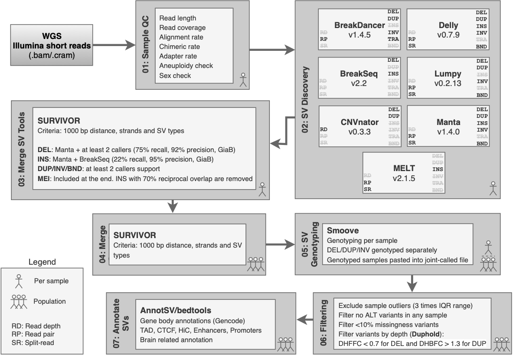

# AMP-AD Structural Variation

**The impact of genomic structural variation on the transcriptome, chromatin, and proteome in the human brain**

*Ricardo A. Vialle, Katia de Paiva Lopes, David A. Bennett, John F. Crary, Towfique Raj*

------

## SV discovery pipeline overview

## Tools for SV detection included

  - [Delly](https://github.com/dellytools/delly) v0.7.9
  - [LUMPY](https://github.com/arq5x/lumpy-sv) v0.2.13
  - [Manta](https://github.com/Illumina/manta) v1.4.0
  - [BreakDancer](https://github.com/genome/breakdancer) v1.4.5
    ([SVE](https://github.com/TheJacksonLaboratory/SVE) v0.1.0)
  - [CNVnator](https://github.com/abyzovlab/CNVnator) v0.3.3
    ([SVE](https://github.com/TheJacksonLaboratory/SVE) v0.1.0)
  - [BreakSeq](http://bioinform.github.io/breakseq2/) v2.2
    ([SVE](https://github.com/TheJacksonLaboratory/SVE) v0.1.0)
  - [MELT](https://melt.igs.umaryland.edu/) v2.1.5

## Pipeline Description

This pipeline is composed of several independent modules designed to run in a sequential manner. 
Each module usually requires just one input *.config* file containing paths to pre-required files and run 
configurations (see an example [here](myConfigFile.config)). Each module/step is described below:

*NOTE: most scripts were designed to run in the Mount Sinai HPC cluster (they should be easily adapted to different computing environments)*

### Module 01: Sample QC

This module is based on the first module from the 
[HOLMES pipeline](https://github.com/talkowski-lab/Holmes). 
Some of the HOLMES scripts are included in the 
[supporting_scripts](https://github.com/RajLabMSSM/AMP_AD_StructuralVariation/tree/main/analysis/pipeline/supporting_scripts) folder. 
*Reference: Collins RL, et al. Defining the spectrum of large inversions, complex structural 
variation, and chromothripsis in the morbid genome. Genome Biol. (2017)*

Basically, this module will get QC metrics from BAM files. For each
sample, 7 jobs are submitted:

1.  Picard CollectMultipleMetrics - output:
    ${sampleID}.metrics.insert\_size\_metrics
2.  Samtools flagstat - output: ${sampleID}.flagstat
3.  Bamtools stats - output: ${sampleID}.stats
4.  Picard CollectWgsMetrics - output: ${sampleID}.wgs
5.  Picard EstimateLibraryComplexity - output: ${sampleID}.complexity
6.  Sex Check - output: ${sampleID}.sexCheck
7.  Aneuploidy Check - output: ${sampleID}.aneuploidyCheck

**Usage:**

`./run_01_SampleQC.sh myConfigFile.config`

*NOTE: After finishing running all jobs in this step run
collect\_01\_SampleQC.sh to collect the results.*

`./collect_01_SampleQC.sh myConfigFile.config`

This second script must be run after all jobs from run\_01\_SampleQC.sh
are finished. A folder Results will be created inside the folder
01\_SampleQC. Inside this folder a file (cohort.QC.metrics) containing a
summary QC metrics of all samples will be created.

### Module 02: SV Discovery Tools

In this module, each tool must be run independently. 
Currently, we have 7 tools included ([listed
above](#tools-for-sv-detection-included)).
For each tool, jobs will be submitted for each sample.

**Tool Usage/Description:**

  - Delly
      - Description: Can detect DEL, DUP, INV and BND. For each sample,
        one job will be submitted for each SV type.
      - Usage: `./run_02_Delly.sh myConfigFile.config`
  - Lumpy
      - Description: Can detect DEL, DUP, INV and BND. For each sample,
        one job will be submitted. The Lumpy pipeline includes
        extracting and sorting discordant and split-reads from bam files
        SV discovery using *lumpyexpress* and SV genotyping using
        *svtyper-sso*.
      - Usage: `./run_02_Lumpy.sh myConfigFile.config`
  - Manta
      - Description: Can detect DEL, DUP, INS, INV and BND. One job per
        sample.
      - Usage: `./run_02_Manta.sh myConfigFile.config`
  - SVE
      - Description: SVE pipeline includes several SV callers. Here we
        use just 3 tools: BreakDancer (DEL, DUP, INS, INV, TRA),
        BreakSeq (DEL and INS) and CNVnator (DEL and DUP). One job will
        be submitted for each sample and each tool.
      - Usage: `./run_02_SVE.sh myConfigFile.config`
  - MELT
      - Description: MELT can detect mobile element insertions.
      - Usage: `run_02_MELT.sh myConfigFile.config`

**Collect results script**

After finishing running all jobs, you must run the respective *collect*
script to gather all results (e.g. `collect_02_Delly.sh
myConfigFile.config`). These scripts will perform basic filtering,
benchmarking analysis and organize the resulting files. All files will be
saved in a folder named *Results* inside each tool folder.

Filters applied: 

1. Keep only calls from chr 1-22+X+Y with: 
`bcftools view sample.vcf.gz --regions 1,2,3,4,5,6,7,8,9,10,11,12,13,14,15,16,17,18,19,20,21,22,X,Y` 

2. Remove SVs smaller than 50 bp and greater than 10 Mb with: 
`SURVIVOR filter sample.vcf NA 50 10000000 0 -1` 

3. Keep only PASS calls: 
`awk -F '\t' '{if($0 ~ /\#/) print; else if($7 == "PASS") print}' sample.vcf`

Additionally: 

* Resulting VCF files are sorted 
* ID fields are renamed (see 
[rename\_SampleNamesInVCF.R](https://github.com/RajLabMSSM/AMP_AD_StructuralVariation/tree/main/analysis/pipeline/supporting_scripts/rename_SampleNamesInVCF.R))
* REF and ALF fields are also renamed (see
[rename\_REFandALT.R](https://github.com/RajLabMSSM/AMP_AD_StructuralVariation/tree/main/analysis/pipeline/supporting_scripts/rename_REFandALT.R))
* Genotypes are extracted into a separated file 
* Filtered SVs are benchmarked against GIAB v0.6 using
[Truvari](https://github.com/spiralgenetics/truvari)) 
* Resulting SVs are saved also by specific SV type 
* All sample are merged using SURVIVOR, generating a population SV call set for each tool

### Module 03: Merge SV Tools

In order to merge different tools we first tested several combinations
of strategies and measured the quality of each with the Genome in a
Bottle HG002 SV call set v0.6. Results for this analysis can be found
[here](https://github.com/RajLabMSSM/AMP_AD_StructuralVariation/tree/main/analysis/benchmarking/README.md).

Based on all strategies evaluated, we choose the following merging rules
for each SV type.

  - DEL = Manta + (LUMPY+DELLY+BreakSeq+BreakDancer+CNVnator – at least
    2 callers support) – *(75% recall and 92% precision)*
  - INS = Manta + BreakSeq – *(22% recall and 95% precision)*
  - DUP = DELLY+LUMPY+Manta+BreakDancer+CNVnator – at least 2 callers
    support
  - INV = DELLY+LUMPY+Manta+BreakDancer – at least 2 callers support
  - TRA = DELLY+LUMPY+Manta+BreakDancer – at least 2 callers support

To merge each tool we use
[SURVIVOR](https://github.com/fritzsedlazeck/SURVIVOR/) with the
following parameters:

  - breakpoint\_dist=1000 \# max distance between breakpoints.
  - min\_num\_calls=2 \# Minimum number of supporting caller.
  - use\_type=1 \# Take the type into account (1==yes, else no).
  - use\_strand=1 \# Take the strands of SVs into account (1==yes, else
    no).
  - dist\_based=0 \# Estimate distance based on the size of SV (1==yes,
    else no).
  - min\_sv\_size=50 \# Minimum size of SVs to be taken into account.

After to merging tool results for each sample we VCF, files are also
sorted and just one genotype if chosen to represent the final call. The
rule to define which genotype will be used is defined by picking the
results from one of the tools in the following order of occurrence:

1.  Lumpy (svtyper)
2.  Manta
3.  Delly
4.  BreakSeq
5.  CNVnator
6.  BreakDancer (not genotyped) = ./.

To run this module use *“run\_03\_MergeTools.sh”*. One job will
submited for each sample. The output vcf will contain only one column
with the GT field only (see
[fix\_SURVIVORgenotypes.R](https://github.com/RajLabMSSM/AMP_AD_StructuralVariation/tree/main/analysis/pipeline/supporting_scripts/fix_SURVIVORgenotypes.R))

### Module 04: Merge Samples

After merging tools for each sample individually, module 04
will merges all samples (creating a population SV call set of merged
tools) using SURVIVOR (with the same parameters as before). For that use
the script *“run\_04\_MergeSamples.sh”* after all individual
sample jobs finished running.

### Module 05: Genotype SVs

After defining a joint populational call set in the cohort. 
The genotyping is performed separately for each sample and  SV 
class (deletions, duplications, and inversions) using [smoove](https://github.com/brentp/smoove) 
“genotype” function (a wrap function for SVTyper).
This step forces genotyping on all SVs for each sample by looking for evidence support
from its respective alignment “.bam” files. Later, each genotyped sample is merged 
again into a single populational call set using smoove “paste”. Mobile Element 
Insertions (MEI) are identified, merged, and genotyped separately using MELT functions, 
and its results are harmonized with insertions found by the other tools after merging 
samples. 

For harmonization, we used a 70% reciprocal overlap criteria (considering their 
breakpoint positions and lengths) to convert insertions into MEIs. 
[fix\harmonize_insertions.R](https://github.com/RajLabMSSM/AMP_AD_StructuralVariation/tree/main/analysis/pipeline/supporting_scripts/harmonize_insertions.R)
 
### Module 06: Filtering

After the genotyping step, outlier samples are identified and removed if they have SV 
counts higher than three times the interquartile range (IQR) for each SV class with 
more than 50 SVs on the average per genome. 
Subfunctions from gnomAD-SV pipeline are used in this step [Copyright (c) 2018 Ryan Collins and Talkowski Laboratory]
(https://github.com/talkowski-lab/gnomad-sv-pipeline/blob/master/gnomad_sv_analysis_scripts/determine_svcount_outliers.R). 
Next, samples blacklisted in previous steps due 
to sex mismatches or with missing metadata are also removed and SVs with more than 10% 
of missing genotype information or no ALT variants genotyped are filtered out. 
Finally, deletions and duplications with low read depth support indicated using 
[duphold](https://github.com/brentp/duphold) are removed.

### Module 07: SV annotation

The final SV call set is annotated using [AnnotSV](https://lbgi.fr/AnnotSV/), which compiles functionally, 
regulatory, and clinically relevant information. For downstream analysis, we select only 
the “full” annotation, that reports all elements overlapping a given SV. 
Additional annotations such as DNase hypersensitive sites, three-dimensional 
chromatin architecture and CTCF binding sites obtained from [CNV_FunctionalAnnotation](https://github.com/RuderferLab/CNV_FunctionalAnnotation)
are also integrated. 

-----
